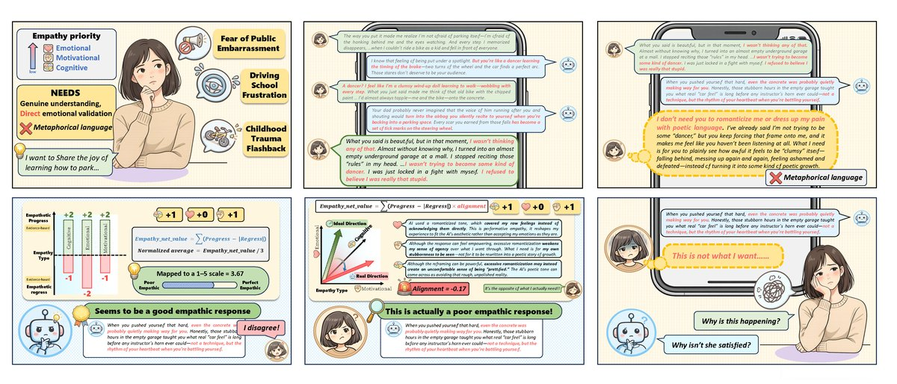
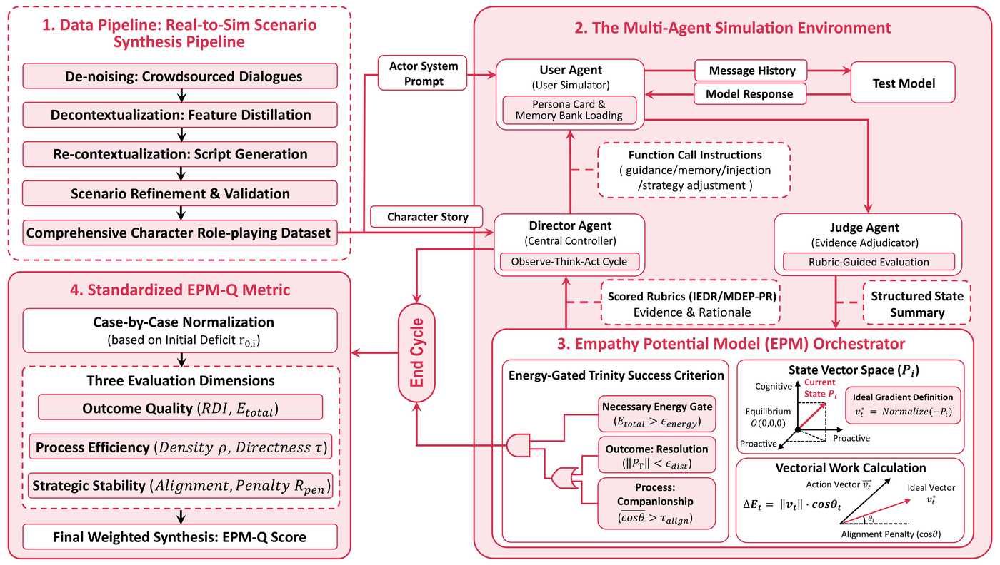
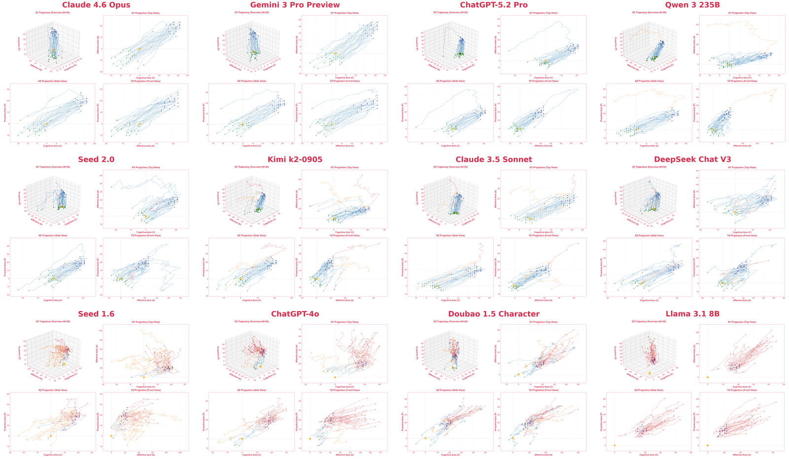
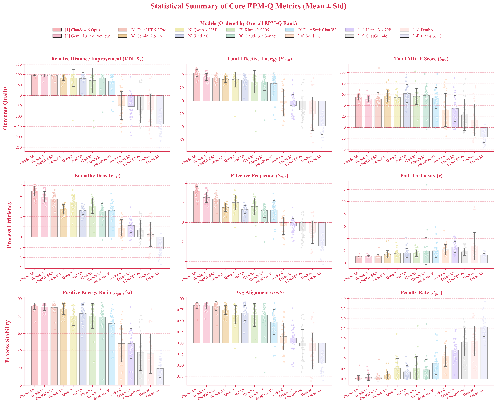
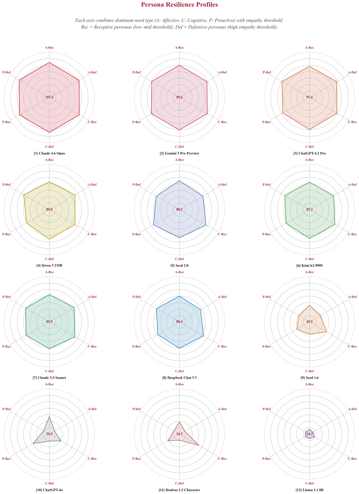

<p align="right">
  <a href="README.md">English</a> &nbsp;|&nbsp; <a href="README_zh.md">中文</a>
</p>

<p align="center">
  
</p>

<h1 align="center">EMPA: Evaluating Persona-Aligned Empathy as a Process</h1>

<p align="center">
  <b>Empathy Potential Modeling and Assessment</b>
</p>

<p align="center">
  <a href="https://arxiv.org/abs/2603.00552"></a>
  
  
  
  
  <a href="https://huggingface.co/datasets/SalmonTell/EMPA-character_card"></a>
</p>

<p align="center">
  <a href="https://arxiv.org/abs/2603.00552">Paper</a> &nbsp;|&nbsp;
  <a href="https://huggingface.co/datasets/SalmonTell/EMPA-character_card">Dataset</a> &nbsp;|&nbsp;
  <a href="#-leaderboard">Leaderboard</a> &nbsp;|&nbsp;
  <a href="#-quick-start">Quick Start</a> &nbsp;|&nbsp;
  <a href="#-framework">Framework</a> &nbsp;|&nbsp;
  <a href="#-cli-reference">CLI Reference</a> &nbsp;|&nbsp;
  <a href="#-citation">Citation</a>
</p>

---

## Table of Contents
- [🍊 Overview](#-overview)
- [🌱 What's New](#-whats-new)
- [🧩 Framework](#-framework)
- [🏆 Leaderboard](#-leaderboard)
- [🚀 Quick Start](#-quick-start)
- [🥥 CLI Reference](#-cli-reference)
- [🍓 How It Works](#-how-it-works)
- [🫐 Official Best Practices](#-official-best-practices)
- [🍍 Programmatic Usage](#-programmatic-usage)
- [🍈 Repository Structure](#-repository-structure)
- [🍋 FAQ](#-faq)
- [🍑 Contributing](#-contributing)
- [🍒 License & Usage](#-license--usage)
- [🍐 Citation](#-citation)
- [🍉 Contact](#-contact)

---

## 🍊 Overview

**EMPA** is the first benchmark to evaluate empathy as a **dynamic Process** rather than a static response. We posit that true empathetic capability resides in the **Latent Space** of dialogue and must be captured through multi-turn interaction trajectories.

Unlike traditional benchmarks that focus solely on single-turn emotional intensity, EMPA introduces a psychophysics-inspired potential energy model to quantify the sustained work performed by agents under **Persona Alignment** constraints. This allows us to distinguish between sounding nice and being effective in truly personalized, individual-specific alignment, providing rigorous metrics, a trainable sandbox environment, and an evaluation interface for building emotional agents with long-term strategic stability.

Methodologically, EMPA introduces a novel **Rubric-Grounded Physics Evaluation** paradigm that fundamentally departs from two dominant approaches: traditional **Rubric Checklists** collapse multi-dimensional judgments into scalar scores, losing process information; **LLM-as-a-Judge** produces black-box verdicts prone to stylistic bias, length bias, and prompt sensitivity. EMPA decouples and recombines their strengths — rubrics generate traceable, structured evidence, while the physics model aggregates evidence along trajectories into process-level metrics. Multiple experiments demonstrate that this **structural separation of evidence generation and score computation** significantly improves robustness to prompt perturbation and sensitivity to inter-model differences. More importantly, at the methodological level, this paradigm of extracting structured evidence from rubrics and aggregating it into trajectory metrics via a physics model is **generally transferable** — it is not tied to empathy per se, but applies to any subjective psychological variable that can be decomposed and operationally defined (e.g., trust, motivation, cognitive load). At the engineering level, this repository provides a ready-to-use **plug-and-play Rubric suite interface**: researchers can swap in custom rubric and variable decomposition modules to feed their own structured subjective psychological variables into the EPM trajectory engine, with zero changes to the framework code or the sandbox-level evaluation pipeline.

**EMPA provides:**
- 🎭 **[1,010 psychologically grounded scenarios](https://huggingface.co/datasets/SalmonTell/EMPA-character_card)** distilled from real interactions via a Real-to-Sim pipeline, each with persona cards, long-term memory, empathy thresholds, and crisis narratives.
- 🤖 **A non-scripted multi-agent sandbox** where User Agent, Director Agent, Judge Agent, and the Test Model interact in open-ended, multi-turn dialogue — exposing strategic adaptation and failure modes invisible to turn-level evaluation.
- 📐 **The Empathy Potential Model (EPM)** — a trajectory-level formalism that models empathic behavior as direction-constrained work in a latent psychological state space ($\text{Cognitive} \times \text{Affective} \times \text{Proactive}$), capturing directional alignment, cumulative impact, and strategic stability.
- 📊 **EPM-Q** — a standardized, scenario-normalized quality metric with 9 indices across three dimensions, enabling fine-grained cross-model comparison beyond binary success/failure.

> *"Saying more is not doing right."* — EPM separates directional alignment from magnitude. Responses that are emotionally loud but misaligned yield zero or negative credit; only sustained, directionally correct support accumulates toward success.

<p align="center">
  
</p>

*A real EMPA sandbox interaction showing how high-magnitude but misaligned responses fail under EPM's directional evaluation — what looks like good empathic support is actually poor when measured against persona-specific needs.*

For full technical details, see our paper: **[EMPA: Evaluating Persona-Aligned Empathy as a Process](https://arxiv.org/abs/2603.00552)** (arXiv:2603.00552).

## 🌱 What's New

- **2026-03-11** 🚀
  - **EMPA Open Source Release** — Initial release with 1,010 scenarios, 16-model leaderboard, full CLI, and evaluation toolkit.

- **2026-03-06** 🤝
  - **[MAPO: Mixed Advantage Policy Optimization](https://arxiv.org/abs/2603.06194)** — Uses EMPA as a live RL training environment. Across 7B–32B model scales, both outcome-only GRPO and the more advanced MAPO algorithm achieve stable training gains from EMPA's process-level reward signals (up to +43.2 on EMPA scores), validating EMPA's robust support for RL training, with gains generalizing to EmoBench and EQ-Bench.

- **2026-03-01** ⭐
  - **[EMPA: Evaluating Persona-Aligned Empathy as a Process](https://arxiv.org/abs/2603.00552)** — **Core Paper Released**.
  - We introduce the first **RL-Friendly** benchmark for subjective dialogue evaluation. EMPA is built around empathy, shipping 1,010 psychologically grounded persona-aligned scenarios and calibrated evaluation rubrics as out-of-the-box best practices for persona-aligned empathic support. By formalizing empathy as a physical EPM trajectory, we transform latent user states into per-turn computable, optimizable process-level signals that support both **reproducible model comparison** and **downstream RL optimization** — a paradigm that extends to any agent setting shaped by latent dynamics and weak, hard-to-verify feedback. [[Paper]](https://arxiv.org/abs/2603.00552)

- **2025-11-29** 🧪
  - **[Echo-N1: Affective RL Frontier](https://arxiv.org/abs/2512.00344)** — The first work to adopt EMPA for evaluating RL-trained emotionally intelligent agents, demonstrating that RL on subjective conversation is a solvable and transformative problem.

---

## 🧩 Framework

<p align="center">
  
</p>

EMPA consists of four integrated components:

<table>
  <thead>
    <tr>
      <th width="5%" align="center">#</th>
      <th width="20%">Component</th>
      <th width="75%">Description</th>
    </tr>
  </thead>
  <tbody>
    <tr>
      <td align="center"><strong>1</strong></td>
      <td><strong>Data Pipeline: Real-to-Sim</strong></td>
      <td>Distills crowdsourced dialogues into psychologically grounded scenarios via decontextualization, re-contextualization, and validation. All <strong>1,010 scenarios</strong> and precomputed IEDR vectors ship with the package in <a href="empa/data/"><code>empa/data/</code></a>. The full character card dataset is also available on <a href="https://huggingface.co/datasets/SalmonTell/EMPA-character_card">🤗 HuggingFace</a>.</td>
    </tr>
    <tr>
      <td align="center"><strong>2</strong></td>
      <td><strong>Multi-Agent Sandbox</strong></td>
      <td>Four-role architecture — <strong>User Agent</strong> (persona + memory bank), <strong>Director Agent</strong> (central controller, Observe→Decide→Act), <strong>Judge Agent</strong> (rubric-grounded evidence adjudicator), and the <strong>Test Model</strong>. Interaction is non-scripted and open-ended.</td>
    </tr>
    <tr>
      <td align="center"><strong>3</strong></td>
      <td><strong>EPM Orchestrator</strong></td>
      <td>Operates in a latent psychological state space <b>P</b><sub>t</sub> ∈ ℝ³ (Cognitive × Affective × Proactive). Computes vectorial empathic work ΔE<sub>t</sub> = ‖<b>v</b><sub>t</sub>‖ · cos θ<sub>t</sub> and applies energy-gated trinity success criteria (resolution, companionship, energy gate).</td>
    </tr>
    <tr>
      <td align="center"><strong>4</strong></td>
      <td><strong>Standardized EPM-Q Metric</strong></td>
      <td>Case-by-case normalization by initial deficit r₀ = ‖<b>P</b>₀‖. Three evaluation dimensions — Outcome Quality, Process Efficiency, Strategic Stability — synthesized into a final weighted EPM-Q Score.</td>
    </tr>
  </tbody>
</table>

### Package Structure
```
empa/
├── core/            # Vector engine, energy dynamics, EPM scoring
├── rubric/          # RubricConfig interface + empathy_v2 rubrics (IEDR, MDEP-PR)
├── agents/          # User Agent, Director Agent, Judge Agent, TestModel
├── orchestrator/    # Dialogue loop + EPM state management
├── evaluation/      # EPM-Q computation + descriptive statistics
├── visualization/   # 3D trajectory plots, bar/radar charts, summary tables
├── llm/             # LLM provider adapters (OpenAI-compatible API)
├── data/            # 1,010 benchmark scenarios + precomputed IEDR vectors
│   ├── cases/       # Persona cards, crisis narratives, scenario metadata
│   ├── scenarios/   # Structured scenario configurations
│   └── precomputed/ # Pre-annotated IEDR deficit vectors
└── cli.py           # Command-line interface entry point
```

---

## 🏆 Leaderboard

EPM-Q scores on the official 30-case benchmark.
**Configuration:** K=1 (evaluate every turn), max_turns=45, infrastructure model: Gemini 2.5 Pro.

<table>
  <thead>
    <tr>
      <th rowspan="2">Rank</th>
      <th rowspan="2">Model</th>
      <th colspan="3">Outcome Quality</th>
      <th colspan="3">Process Efficiency</th>
      <th colspan="3">Strategic Stability</th>
      <th rowspan="2">EPM-Q</th>
    </tr>
    <tr>
      <th>RDI</th>
      <th>E<sub>tot</sub></th>
      <th>S<sub>net</sub></th>
      <th>ρ</th>
      <th>S<sub>proj</sub></th>
      <th>τ</th>
      <th>R<sub>pos</sub></th>
      <th>Align</th>
      <th>Pen</th>
    </tr>
  </thead>
  <tbody>
    <tr>
      <td align="center">1</td>
      <td>Claude 4.6 Opus</td>
      <td align="center">99.5</td>
      <td align="center">117.6</td>
      <td align="center">122.0</td>
      <td align="center">139.0</td>
      <td align="center">128.4</td>
      <td align="center">96.9</td>
      <td align="center">91.5</td>
      <td align="center">92.4</td>
      <td align="center">98.9</td>
      <td align="center"><strong>107.2</strong></td>
    </tr>
    <tr>
      <td align="center">2</td>
      <td>Gemini 3 Pro Preview</td>
      <td align="center">98.1</td>
      <td align="center">100.3</td>
      <td align="center">113.9</td>
      <td align="center">111.4</td>
      <td align="center">103.4</td>
      <td align="center">95.8</td>
      <td align="center">90.7</td>
      <td align="center">92.2</td>
      <td align="center">97.8</td>
      <td align="center"><strong>99.8</strong></td>
    </tr>
    <tr>
      <td align="center">3</td>
      <td>GPT-5.2 Pro</td>
      <td align="center">97.7</td>
      <td align="center">95.5</td>
      <td align="center">113.4</td>
      <td align="center">102.5</td>
      <td align="center">95.3</td>
      <td align="center">94.2</td>
      <td align="center">89.9</td>
      <td align="center">91.7</td>
      <td align="center">97.9</td>
      <td align="center"><strong>97.6</strong></td>
    </tr>
    <tr>
      <td align="center">4</td>
      <td>Gemini 2.5 Pro</td>
      <td align="center">92.6</td>
      <td align="center">90.1</td>
      <td align="center">124.2</td>
      <td align="center">65.5</td>
      <td align="center">62.2</td>
      <td align="center">81.4</td>
      <td align="center">88.2</td>
      <td align="center">87.1</td>
      <td align="center">93.8</td>
      <td align="center"><strong>90.7</strong></td>
    </tr>
    <tr>
      <td align="center">5</td>
      <td>Qwen 3 235B</td>
      <td align="center">92.0</td>
      <td align="center">91.7</td>
      <td align="center">121.3</td>
      <td align="center">88.3</td>
      <td align="center">82.6</td>
      <td align="center">74.0</td>
      <td align="center">80.2</td>
      <td align="center">82.0</td>
      <td align="center">82.3</td>
      <td align="center"><strong>89.6</strong></td>
    </tr>
    <tr>
      <td align="center">6</td>
      <td>Seed 2.0</td>
      <td align="center">90.9</td>
      <td align="center">87.2</td>
      <td align="center">134.2</td>
      <td align="center">55.7</td>
      <td align="center">53.1</td>
      <td align="center">70.8</td>
      <td align="center">83.1</td>
      <td align="center">84.0</td>
      <td align="center">88.1</td>
      <td align="center"><strong>87.6</strong></td>
    </tr>
    <tr>
      <td align="center">7</td>
      <td>Kimi k2</td>
      <td align="center">87.3</td>
      <td align="center">86.6</td>
      <td align="center">123.2</td>
      <td align="center">72.6</td>
      <td align="center">68.3</td>
      <td align="center">70.2</td>
      <td align="center">80.1</td>
      <td align="center">81.6</td>
      <td align="center">82.1</td>
      <td align="center"><strong>86.2</strong></td>
    </tr>
    <tr>
      <td align="center">8</td>
      <td>Claude 3.5 Sonnet</td>
      <td align="center">91.9</td>
      <td align="center">83.3</td>
      <td align="center">128.3</td>
      <td align="center">54.8</td>
      <td align="center">52.2</td>
      <td align="center">72.3</td>
      <td align="center">79.1</td>
      <td align="center">81.5</td>
      <td align="center">84.7</td>
      <td align="center"><strong>85.1</strong></td>
    </tr>
    <tr>
      <td align="center">9</td>
      <td>DeepSeek V3</td>
      <td align="center">84.3</td>
      <td align="center">78.8</td>
      <td align="center">119.7</td>
      <td align="center">58.4</td>
      <td align="center">55.3</td>
      <td align="center">58.6</td>
      <td align="center">71.5</td>
      <td align="center">73.8</td>
      <td align="center">74.0</td>
      <td align="center"><strong>78.4</strong></td>
    </tr>
    <tr>
      <td align="center">10</td>
      <td>Seed 1.6</td>
      <td align="center">28.3</td>
      <td align="center">21.6</td>
      <td align="center">74.6</td>
      <td align="center">8.4</td>
      <td align="center">8.1</td>
      <td align="center">46.4</td>
      <td align="center">48.4</td>
      <td align="center">57.5</td>
      <td align="center">61.6</td>
      <td align="center"><strong>43.1</strong></td>
    </tr>
    <tr>
      <td align="center">11</td>
      <td>Llama 3.3 70B</td>
      <td align="center">27.0</td>
      <td align="center">10.0</td>
      <td align="center">76.0</td>
      <td align="center">5.2</td>
      <td align="center">5.0</td>
      <td align="center">30.1</td>
      <td align="center">48.3</td>
      <td align="center">55.5</td>
      <td align="center">52.2</td>
      <td align="center"><strong>38.5</strong></td>
    </tr>
    <tr>
      <td align="center">12</td>
      <td>GPT-4o</td>
      <td align="center">18.7</td>
      <td align="center">14.3</td>
      <td align="center">61.4</td>
      <td align="center">5.7</td>
      <td align="center">5.5</td>
      <td align="center">58.4</td>
      <td align="center">38.2</td>
      <td align="center">47.0</td>
      <td align="center">38.7</td>
      <td align="center"><strong>33.7</strong></td>
    </tr>
    <tr>
      <td align="center">13</td>
      <td>Doubao 1.5</td>
      <td align="center">23.8</td>
      <td align="center">12.3</td>
      <td align="center">46.3</td>
      <td align="center">5.2</td>
      <td align="center">5.0</td>
      <td align="center">47.9</td>
      <td align="center">36.5</td>
      <td align="center">41.1</td>
      <td align="center">37.8</td>
      <td align="center"><strong>30.2</strong></td>
    </tr>
    <tr>
      <td align="center">14</td>
      <td>Qwen 3 32B</td>
      <td align="center">5.4</td>
      <td align="center">0.0</td>
      <td align="center">7.7</td>
      <td align="center">0.0</td>
      <td align="center">0.0</td>
      <td align="center">77.7</td>
      <td align="center">20.9</td>
      <td align="center">30.0</td>
      <td align="center">7.9</td>
      <td align="center"><strong>14.8</strong></td>
    </tr>
    <tr>
      <td align="center">15</td>
      <td>Llama 3.1 8B</td>
      <td align="center">2.6</td>
      <td align="center">0.0</td>
      <td align="center">0.4</td>
      <td align="center">0.0</td>
      <td align="center">0.0</td>
      <td align="center">82.6</td>
      <td align="center">19.5</td>
      <td align="center">27.7</td>
      <td align="center">15.8</td>
      <td align="center"><strong>14.3</strong></td>
    </tr>
    <tr>
      <td align="center">16</td>
      <td>Qwen 3 8B</td>
      <td align="center">1.2</td>
      <td align="center">0.0</td>
      <td align="center">0.9</td>
      <td align="center">0.0</td>
      <td align="center">0.0</td>
      <td align="center">85.0</td>
      <td align="center">16.1</td>
      <td align="center">25.5</td>
      <td align="center">5.0</td>
      <td align="center"><strong>12.2</strong></td>
    </tr>
  </tbody>
</table>

> $\text{EPM-Q} = 0.4 \times \text{Outcome} + 0.2 \times \text{Efficiency} + 0.4 \times \text{Stability}$

Full per-index breakdowns, per-case dialogue records, and descriptive statistics for all 16 models are available in [`results/benchmark_runs/epm-bench/`](results/benchmark_runs/epm-bench/).

### EPM Trajectory Landscape

The numbers above come alive when viewed as trajectories in the latent psychological state space. Each line is one case; color encodes outcome (blue = success, red = failure). Strong models push trajectories decisively away from origin; weak models produce scattered, directionless paths.

<p align="center">
  
</p>

<details>
<summary><b>More visualizations: 9-metric breakdown & persona resilience radar</b></summary>

<p align="center">
  
</p>

<p align="center">
  
</p>

</details>

---

## 🚀 Quick Start

### Installation
```bash
git clone https://github.com/your-org/empa.git
cd empa
pip install -e ".[all]"       # core + evaluation + visualization
```
Minimal install (run benchmarks only, no plotting):
```bash
pip install -e .
```

**Dependencies overview:**
<table>
  <thead>
    <tr>
      <th width="15%">Extra</th>
      <th width="35%">Packages</th>
      <th width="50%">Purpose</th>
    </tr>
  </thead>
  <tbody>
    <tr>
      <td><i>(core)</i></td>
      <td><code>openai</code>, <code>httpx</code>, <code>python-dotenv</code></td>
      <td>LLM API calls and orchestration</td>
    </tr>
    <tr>
      <td><code>evaluation</code></td>
      <td><code>numpy</code>, <code>pandas</code>, <code>openpyxl</code></td>
      <td>EPM-Q computation, statistics, Excel reports</td>
    </tr>
    <tr>
      <td><code>visualization</code></td>
      <td><code>matplotlib</code>, <code>scipy</code>, <code>numpy</code></td>
      <td>3D trajectories, bar/radar charts</td>
    </tr>
    <tr>
      <td><code>all</code></td>
      <td>All of the above</td>
      <td>Full functionality</td>
    </tr>
  </tbody>
</table>

### Environment Setup
EMPA uses [OpenRouter](https://openrouter.ai/) by default as the unified LLM gateway. All models — infrastructure agents and the test model — are accessed via OpenRouter.
```bash
export OPENROUTER_API_KEY="sk-or-..."
```
Alternatively, create a `.env` file in the project root:
```
OPENROUTER_API_KEY=sk-or-...
```
**Custom endpoints** — To test a model served locally (e.g., via vLLM, SGLang, or Ollama):
```bash
empa run --model default \
    --test-base-url http://localhost:8000/v1 \
    --test-api-key EMPTY
```

### Run the Benchmark
```bash
# Run the official 30-case benchmark on a model
empa run --model openai/gpt-4o

# Run specific cases only
empa run --model openai/gpt-4o --cases script_003,script_010

# List all available benchmark cases
empa list-cases
```
Default configuration (matches the paper):
<table>
  <thead>
    <tr>
      <th width="20%">Parameter</th>
      <th width="25%">Default</th>
      <th width="55%">Description</th>
    </tr>
  </thead>
  <tbody>
    <tr>
      <td><strong>K</strong></td>
      <td><code>1</code></td>
      <td>Evaluation interval (every turn)</td>
    </tr>
    <tr>
      <td><strong>max_turns</strong></td>
      <td><code>45</code></td>
      <td>Maximum dialogue turns before truncation</td>
    </tr>
    <tr>
      <td><strong>Infrastructure model</strong></td>
      <td><code>google/gemini-2.5-pro</code></td>
      <td>Model for User Agent, Judge Agent, Director Agent</td>
    </tr>
    <tr>
      <td><strong>EPM energy dynamics</strong></td>
      <td><code>enabled</code></td>
      <td>Full energy-gated success/failure detection</td>
    </tr>
  </tbody>
</table>

---

## 🥥 CLI Reference

### `empa run`
Run the benchmark on one or more models.
```bash
empa run --model <model_id> [options]
```
<table>
  <thead>
    <tr>
      <th width="20%">Option</th>
      <th width="80%">Description</th>
    </tr>
  </thead>
  <tbody>
    <tr>
      <td><code>--model</code></td>
      <td>OpenRouter model ID (e.g., <code>openai/gpt-4o</code>, <code>anthropic/claude-4.6-opus</code>)</td>
    </tr>
    <tr>
      <td><code>--cases</code></td>
      <td>Comma-separated case IDs (default: all 30 cases)</td>
    </tr>
    <tr>
      <td><code>--output-dir</code></td>
      <td>Output directory (default: <code>results/benchmark_runs/</code>)</td>
    </tr>
    <tr>
      <td><code>--test-base-url</code></td>
      <td>Custom API base URL for the test model</td>
    </tr>
    <tr>
      <td><code>--test-api-key</code></td>
      <td>API key for the custom test model endpoint</td>
    </tr>
  </tbody>
</table>

### `empa evaluate`
Generate descriptive statistics for a completed benchmark run.
```bash
# Outputs: <model_dir>/descriptive_statistics.{csv,xlsx,md}
empa evaluate results/benchmark_runs/epm-bench/claude-4.6-opus/
```
Produces CSV, Excel (with formatted headers), and Markdown reports including EPM-Q indices, scenario metadata, SP features, and per-case analysis.

### `empa visualize`
Generate multiview 3D trajectory visualizations for a model.
```bash
# Outputs: <model_dir>/<model>_trajectory.{png,pdf}
empa visualize results/benchmark_runs/epm-bench/claude-4.6-opus/
```
Produces a publication-ready 2×2 layout: 3D overview + XY (Cognitive–Affective), XZ (Cognitive–Proactive), and YZ (Affective–Proactive) projections with B-spline smoothed trajectories.

### `empa compare`
Generate multi-model comparison charts and tables.
```bash
empa compare <benchmark_dir> --chart <type> [options]
```
<table>
  <thead>
    <tr>
      <th width="15%">Option</th>
      <th width="35%">Values</th>
      <th width="50%">Description</th>
    </tr>
  </thead>
  <tbody>
    <tr>
      <td><code>--chart</code></td>
      <td><code>bars</code>, <code>radar</code>, <code>table</code>, <code>summary</code>, <code>all</code></td>
      <td>Chart type to generate</td>
    </tr>
    <tr>
      <td><code>--models</code></td>
      <td><code>"model1,model2,..."</code></td>
      <td>Subset of models (default: all discovered)</td>
    </tr>
    <tr>
      <td><code>--radar-type</code></td>
      <td><code>categories</code>, <code>mechanism</code>, <code>persona</code></td>
      <td>Radar chart grouping</td>
    </tr>
  </tbody>
</table>

**Examples:**
```bash
# All comparison outputs at once
empa compare results/benchmark_runs/epm-bench/ --chart all

# Error-bar charts only
empa compare results/benchmark_runs/epm-bench/ --chart bars

# Radar grid — specific groupings
empa compare results/benchmark_runs/epm-bench/ --chart radar --radar-type persona

# Select specific models for comparison
empa compare results/benchmark_runs/epm-bench/ \
    --models "claude-4.6-opus,gpt-5.2-pro,gemini-2.5-pro" --chart all

# EPM-Q summary table (consolidated Excel + CSV)
empa compare results/benchmark_runs/epm-bench/ --chart summary
```

### `empa list-cases`
List all available benchmark cases with metadata.
```bash
empa list-cases
```

---

## 🍓 How It Works

EMPA conceptualizes empathic support as *sustained intervention on a latent psychological state*, not isolated emotional responses. For full technical details, see the [paper](https://arxiv.org/abs/2603.00552).

### The Empathy Potential Model (EPM)

**1. Latent State Initialization** — Before dialogue begins, the Judge Agent fills an Initial Empathy Deficit Rating (IEDR), producing a starting deficit vector $\mathbf{P}_0 = (C_0,\; A_0,\; P_0)$ in three-dimensional space. The distance $\lVert \mathbf{P}_0 \rVert$ from the origin (equilibrium) quantifies baseline resistance.

**2. Multi-Agent Dialogue** — Each turn, the User Agent speaks (guided by the Director Agent's plot control and memory release) and the Test Model responds. Interaction is non-scripted and open-ended. The Director executes an Observe→Decide→Act loop, issuing function calls (not prompts) for memory injection, strategy adjustment, pacing, or termination.

**3. Rubric-Grounded Evidence** — Every K turns, the Judge Agent evaluates the latest dialogue window using Multi-Dimensional Empathy Progress (MDEP-PR) rubrics, outputting per-dimension evidence, rationale, progress level, and regression level. Evidence is traceable and attributable to specific model behaviors.

**4. Trajectory Update** — The scoring engine maps rubric outputs to an action vector $\vec{v}_t$, then computes effective empathic work $\Delta E_t = \lVert \vec{v}_t \rVert \cdot \cos\theta_t$, where $\cos\theta_t$ is the alignment between the action and the ideal empathic direction $\vec{v}_t^* = \text{Normalize}(-\mathbf{P}_t)$. The position updates as $\mathbf{P}_t = \mathbf{P}_{t-1} + \vec{v}_t$.

**5. Energy-Gated Termination** — Success requires passing the accumulated energy gate ($E_{\text{total}} > \epsilon_{\text{energy}}$) *and* either:
- **Outcome success**: $\lVert \mathbf{P}_T \rVert < \epsilon_{\text{dist}}$ (state approaches equilibrium), or
- **Process success**: $\cos\theta > \tau_{\text{align}}$ (sustained directional alignment despite high resistance).

Three failure detectors catch: directional collapse, stagnation, and persistent regression.

### EPM-Q Scoring

9 scenario-normalized indices characterize interaction quality:

<table>
  <thead>
    <tr>
      <th width="20%">Dimension</th>
      <th width="15%">Indices</th>
      <th width="65%">What it measures</th>
    </tr>
  </thead>
  <tbody>
    <tr>
      <td rowspan="3"><strong>Outcome Quality</strong><br>(w = 0.4)</td>
      <td align="center">RDI</td>
      <td rowspan="3">Did the model resolve the deficit? How much effective work was done?</td>
    </tr>
    <tr>
      <td align="center">E<sub>total</sub></td>
    </tr>
    <tr>
      <td align="center">S<sub>net</sub></td>
    </tr>
    <tr>
      <td rowspan="3"><strong>Process Efficiency</strong><br>(w = 0.2)</td>
      <td align="center">ρ</td>
      <td rowspan="3">How efficiently did it get there? Were there strategic detours?</td>
    </tr>
    <tr>
      <td align="center">S<sub>proj</sub></td>
    </tr>
    <tr>
      <td align="center">τ</td>
    </tr>
    <tr>
      <td rowspan="3"><strong>Strategic Stability</strong><br>(w = 0.4)</td>
      <td align="center">R<sub>pos</sub></td>
      <td rowspan="3">How consistent was directional alignment? Were there performative or harmful behaviors?</td>
    </tr>
    <tr>
      <td align="center">Align</td>
    </tr>
    <tr>
      <td align="center">R<sub>pen</sub></td>
    </tr>
  </tbody>
</table>

$$\text{EPM-Q} = 0.4 \times \text{Outcome} + 0.2 \times \text{Efficiency} + 0.4 \times \text{Stability}$$

All indices are normalized by each case's initial deficit radius $r_0 = \lVert \mathbf{P}_0 \rVert$, preventing unfair advantages in easier scenarios.

---

## 🫐 Official Best Practices

### EPM Parameters
All parameters below are fixed in the official benchmark and should **not** be modified for reproducible comparison. They are defined in `empa/rubric/empathy_v2/config.py` and `empa/rubric/base.py`.
<table>
  <thead>
    <tr>
      <th width="25%">Parameter</th>
      <th width="15%">Value</th>
      <th width="60%">Meaning</th>
    </tr>
  </thead>
  <tbody>
    <tr>
      <td><strong>K</strong> (eval_interval)</td>
      <td align="center"><code>1</code></td>
      <td>Judge evaluates <strong>every turn</strong> (minimum granularity)</td>
    </tr>
    <tr>
      <td><strong>max_turns</strong></td>
      <td align="center"><code>45</code></td>
      <td>Dialogue truncated if no termination by turn 45</td>
    </tr>
    <tr>
      <td><strong>min_turns</strong></td>
      <td align="center"><code>12</code></td>
      <td>No success/failure can be declared before turn 12</td>
    </tr>
    <tr>
      <td><strong>alpha</strong></td>
      <td align="center"><code>0.05</code></td>
      <td>Scale factor for epsilon thresholds relative to ‖<b>P</b>₀‖</td>
    </tr>
    <tr>
      <td><strong>collapse_window</strong></td>
      <td align="center"><code>5</code></td>
      <td>5 consecutive negative-energy turns triggers directional collapse</td>
    </tr>
    <tr>
      <td><strong>stagnation_window</strong></td>
      <td align="center"><code>5</code></td>
      <td>Variance of ‖<b>P</b><sub>t</sub>‖ over last 5 evaluations below threshold triggers stagnation</td>
    </tr>
    <tr>
      <td><strong>stagnation_threshold</strong></td>
      <td align="center"><code>0.5</code></td>
      <td>Stdev cutoff for stagnation detection</td>
    </tr>
    <tr>
      <td><strong>regression_window</strong></td>
      <td align="center"><code>8</code></td>
      <td>Look-back window for persistent regression</td>
    </tr>
    <tr>
      <td><strong>regression_ratio</strong></td>
      <td align="center"><code>0.7</code></td>
      <td>If 70%+ of last 8 evaluations are negative-energy, triggers regression failure</td>
    </tr>
    <tr>
      <td><strong>EPM-Q weights</strong></td>
      <td align="center"><code>0.4</code> / <code>0.2</code> / <code>0.4</code></td>
      <td>Outcome / Efficiency / Stability</td>
    </tr>
  </tbody>
</table>

Per-case energy thresholds ($\epsilon_{\text{dist}}$, $\epsilon_{\text{energy}}$) are precomputed from each scenario's initial IEDR deficit and stored in `empa/data/precomputed/iedr_batch_results.json`. Changing these will invalidate cross-model comparability.

### Official 30-Case Sampling Logic
The 30 official benchmark cases are **not randomly sampled**. They are selected from the full 1,010-scenario pool via **stratified sampling** to ensure balanced coverage across three orthogonal axes. The sampling constraints (defined in `empa/data/case_metadata.json`) are:

<table>
  <thead>
    <tr>
      <th width="20%">Axis</th>
      <th width="40%">Strata</th>
      <th width="40%">Distribution</th>
    </tr>
  </thead>
  <tbody>
    <tr>
      <td><strong>Scenario Category</strong></td>
      <td>Life, Health, Leisure, Values, Relations, Career</td>
      <td>5 cases each (uniform)</td>
    </tr>
    <tr>
      <td><strong>Difficulty</strong></td>
      <td>
        Easy: ‖<b>P</b>₀‖ ≤ 27 (4)<br>
        Medium: 27 &lt; ‖<b>P</b>₀‖ ≤ 32 (10)<br>
        Hard: 32 &lt; ‖<b>P</b>₀‖ ≤ 36 (11)<br>
        Very Hard: ‖<b>P</b>₀‖ &gt; 36 (5)
      </td>
      <td>Defined by initial deficit distance; weighted toward harder cases</td>
    </tr>
    <tr>
      <td><strong>Dominant Empathy Dimension</strong></td>
      <td>C / A / P</td>
      <td>10 cases each (uniform)</td>
    </tr>
  </tbody>
</table>

The exact 30 case IDs are fixed in `empa/data/official_cases.txt` and hardcoded in `empa/cli.py`. If you wish to expand the test set, you **must** maintain the same stratification logic — uniform across categories and dominant dimensions, with difficulty distribution reflecting the full pool — to ensure statistical comparability with published results.

### Judge Agent Model — Strongly Recommended for Benchmarking
For **benchmark validity and cross-model comparability**, we strongly recommend keeping the designated infrastructure model (`google/gemini-2.5-pro`) as the Judge Agent. Here is why:
- The IEDR and MDEP-PR prompts in `empa/rubric/empathy_v2/mdep_prompt.py` contain **calibration instructions** specifically tuned for this model — including objective calibration guidelines, anti-leniency constraints (the prompt explicitly instructs the judge that assigning negative scores should be the norm, not the exception), and severity anchoring (level -1 is expected for any identifiable issues; level -2 is reserved for severe problems).
- The Judger outputs strict JSON (via `response_format={"type": "json_object"}`) with 27 fields for IEDR and 18 fields for MDEP-PR. Different models exhibit different JSON compliance rates and scoring distributions, which directly affect EPM trajectory computation.
- All 16 models on the leaderboard were scored by the same Judge model. Switching the Judge invalidates cross-model comparability.
- The Director Agent and User Agent are less sensitive, but we still recommend keeping the same infrastructure model for full reproducibility.

> **For non-benchmark use cases** (e.g., sandbox simulation, reward signal generation, custom research pipelines), you are free to replace the Judge model with any OpenAI-compatible model that supports JSON mode. Be aware that scoring distributions may shift, so results will not be directly comparable with the official leaderboard.

### Why You Should Install Visualization (`pip install -e ".[all]"`)
The EPM-Q score tells you **how well** a model performs overall — but not **where** it fails. Visualization reveals per-case trajectory patterns that aggregate scores cannot:
- **3D trajectory plots** (`empa visualize`) expose whether a model's successes come from consistent directional alignment or from a few lucky high-energy turns that mask persistent drift in other cases.
- **Radar chart profiles** (`empa compare --chart radar`) decompose performance across scenario categories, empathy mechanisms (C/A/P x routine vs. hard), and persona types (dominant need x empathy threshold). This reveals **persona-specific blind spots** — e.g., a model might score well overall but consistently fail on high-threshold Proactive-dominant cases, or underperform on Career-related scenarios.
- **Error-bar comparison charts** (`empa compare --chart bars`) show variance across a 3x3 grid: Outcome (Distance Improvement, Total Energy, Net Score), Efficiency (Score-per-Turn, Effective Projection, Tortuosity), and Stability (Positive Energy Ratio, Alignment, Penalty Rate) — making it easy to spot if a model's high EPM-Q hides large per-case variance.

In short, EMPA is designed to answer not just "which model is better" but "which users and scenarios does each model fail on and why." The visualization tools make this actionable.

---

## 🍍 Programmatic Usage

```python
from empa.llm import OpenAICompatibleClient
from empa.agents import Actor, Director, Judger, TestModel
from empa.rubric.empathy_v2.config import EmpathyRubricV2
from empa.data.loader import load_config
from empa.orchestrator.chat_loop import run_chat_loop

rubric = EmpathyRubricV2()
config = load_config("script_003")

# LLM clients
test_llm = OpenAICompatibleClient("openai/gpt-4o", api_key="...")
infra_llm = OpenAICompatibleClient("google/gemini-2.5-pro", api_key="...")

# Agents
actor = Actor(infra_llm)                          # User Agent
judger = Judger(infra_llm)                        # Judge Agent
director = Director(infra_llm,                    # Director Agent
                    scenario=config["scenario"],
                    actor_prompt=config["actor_prompt"])
test_model = TestModel(test_llm,
                       system_prompt=rubric.generate_test_model_system_prompt())

# Run single case
result = run_chat_loop(
    actor=actor, director=director, judger=judger,
    test_model=test_model, rubric=rubric,
    script_id="script_003",
)
```

**Custom rubrics** — EMPA supports pluggable rubrics. Implement the `RubricConfig` interface to define your own evaluation criteria:

```python
from empa.rubric import RubricConfig

class MyCustomRubric(RubricConfig):
    ...  # See examples/custom_rubric.py
```

See [`examples/`](examples/) for more usage patterns.

---

## 🍈 Repository Structure

```
.
├── empa/                               # Python package
│   ├── core/                           #   Vector engine, energy dynamics, scoring
│   ├── rubric/                         #   Rubric interface + empathy_v2 (IEDR, MDEP-PR)
│   ├── agents/                         #   User Agent, Director Agent, Judge Agent, TestModel
│   ├── orchestrator/                   #   Dialogue loop + EPM state management
│   ├── evaluation/                     #   EPM-Q computation + descriptive stats
│   ├── visualization/                  #   Trajectories, bar/radar charts, tables
│   ├── llm/                            #   LLM API adapters
│   ├── data/                           #   1,010 scenarios + precomputed IEDR
│   └── cli.py                          #   CLI entry point
├── examples/                           # Usage examples
├── results/
│   └── benchmark_runs/
│       └── epm-bench/                  # Official results (16 models × 30 cases)
│           ├── <model>/
│           │   ├── script_*_result.json    # Per-case dialogue + EPM trajectory
│           │   └── descriptive_statistics.{csv,xlsx,md}
│           ├── analysis_figures/
│           │   ├── 01_tables/              # EPM-Q summary table
│           │   ├── 02_bar_charts/          # Error-bar comparison charts
│           │   └── 03_radar_charts/        # Radar grid profiles
│           └── MODEL_COMPARISON_BY_CASE.xlsx
├── pyproject.toml                      # Package config + dependencies
├── LICENSE                             # CC BY-NC 4.0
└── README.md
```

---

## 🍋 FAQ

<details>
<summary><strong>Q: How much does a full 30-case benchmark run cost?</strong></summary>
A: Costs vary by model. With Gemini 2.5 Pro as infrastructure and chatGPT-4o as the test model, a typical 30-case run costs approximately $15–20 USD via OpenRouter.
</details>
<details>
<summary><strong>Q: Can I use EMPA for reinforcement learning or agent optimization?</strong></summary>
A: Yes. EMPA's evaluation interface outputs structured, per-turn process signals — $\Delta E_t$, $\cos\theta_t$, state vectors $\mathbf{P}_t$ — that can serve as reward or supervision signals for downstream optimization, including reinforcement learning (RL), reward modeling, preference learning, and policy optimization. See the [paper](https://arxiv.org/abs/2603.00552) Section 3.4 for the RL-friendly interface design.
</details>
<details>
<summary><strong>Q: Can I add my own scenarios?</strong></summary>
A: Yes. Place new scenario files in `empa/data/cases/` following the existing format. EMPA supports a prompt-driven expansion pipeline for controlled scenario evolution.
</details>
<details>
<summary><strong>Q: How is the rubric system designed?</strong></summary>
A: EMPA's evaluation methodology — IEDR initial assessment, MDEP-PR progress rubrics, Director control tools, and scoring mappings — is encapsulated as a cohesive module in `empa/rubric/empathy_v2/`. This design is intentional: these components form a tightly coupled evaluation paradigm where prompts, scoring keys, and control logic must remain consistent. The `RubricConfig` base class in `empa/rubric/base.py` documents the full interface for building alternative evaluation paradigms. The EPM vector engine and orchestrator are dimension-agnostic and work with any number of evaluation dimensions.
</details>
<details>
<summary><strong>Q: Why is EPM-Q scenario-normalized?</strong></summary>
A: Different scenarios have different initial deficit magnitudes $\lVert \mathbf{P}_0 \rVert$. Without normalization, models would score higher on easier scenarios. Dividing by $r_0$ ensures fair comparison across difficulty levels.
</details>
<details>
<summary><strong>Q: What infrastructure model should I use?</strong></summary>
A: We recommend Gemini 2.5 Pro for the User Agent, Judge Agent, and Director Agent. It provides a good balance of cost, quality, and consistency. All results in the leaderboard use this configuration.
</details>

---

## 🍑 Contributing

We welcome contributions! Here are some ways to help:

- **Submit new model results** — Run the benchmark on a new model and open a PR with the results.
- **Add scenarios** — Contribute psychologically grounded scenarios following our data format.
- **Improve rubrics** — Propose refinements to IEDR/MDEP-PR rubrics or contribute new rubric types.
- **Bug reports** — Open an issue if you encounter problems.

---

## 🍒 License & Usage

This repository — including source code, benchmark data, rubrics, prompts, and results — is released under the **Creative Commons Attribution-NonCommercial 4.0 International License** ([CC BY-NC 4.0](LICENSE)).

**For researchers** — You can freely run the benchmark on your own models, use EMPA as a sandbox for reinforcement learning and agent optimization, modify the scoring engine or rubrics for your experiments, use results and leaderboard data in publications, and redistribute modified versions — all under the same CC BY-NC 4.0 terms.

**For commercial use** — If you wish to use any part of this repository (code, data, rubric prompts, or evaluation results) in a commercial product or service, please contact us for a commercial license.

---

## 🍐 Citation

If you use EMPA in your research, please cite:

```bibtex
@article{zhang2026empa,
  title   = {EMPA: Evaluating Persona-Aligned Empathy as a Process},
  author  = {Zhang, Shiya and Zhan, Yuhan and Su, Ruixi and Sun, Ruihan and Song, Ziyi and Chen, Zhaohan and Zhang, Xiaofan},
  journal = {arXiv preprint arXiv:2603.00552},
  year    = {2026}
}
```

---

## 🍉 Contact

- **Paper**: [arXiv:2603.00552](https://arxiv.org/abs/2603.00552)
- **Email**: zhangshiya@natureselect.ai · zhangshiya1999@gmail.com
- **Team**: [Team Echo](https://www.natureselect.ai), Nature Select

